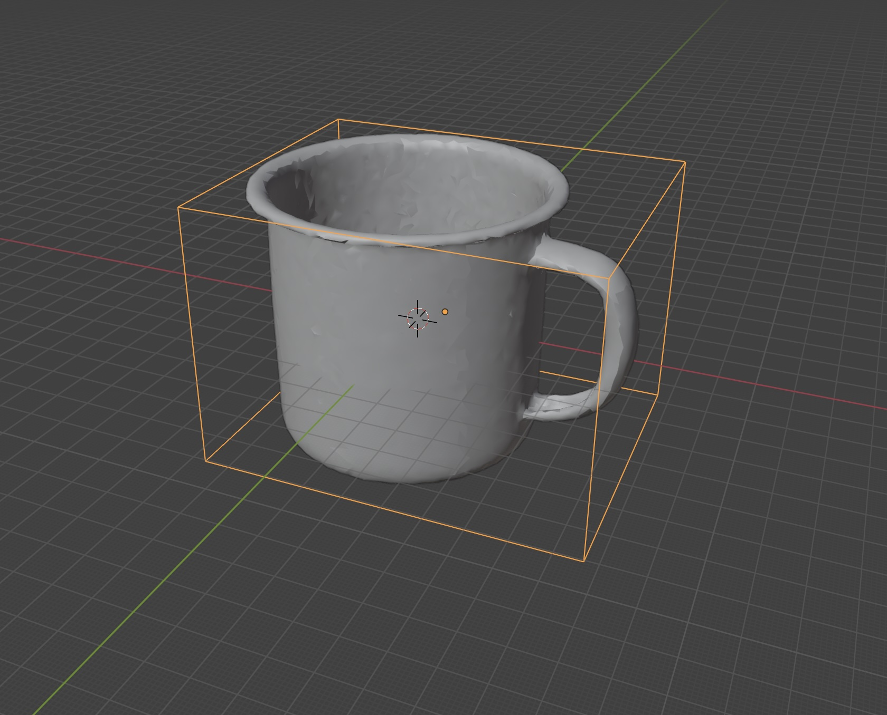
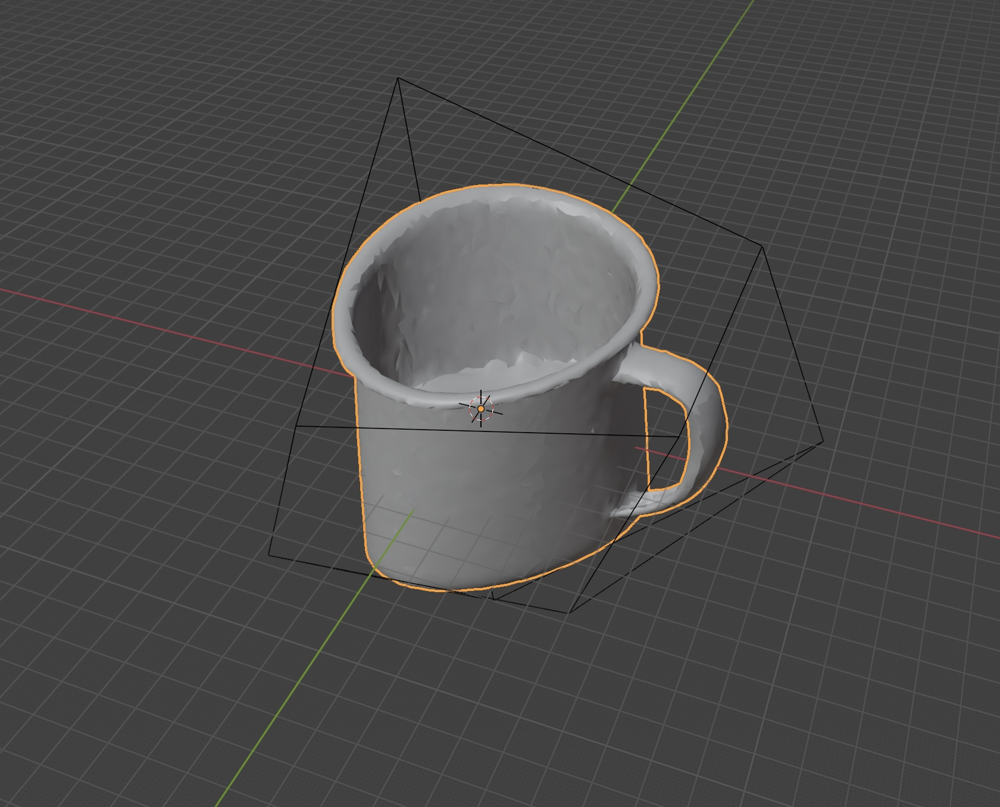

# Python Implementation of B-spline Lattice Deformation (2×2×2)

This repository provides a NumPy and PyTorch implementation of B-spline interpolation using a 2×2×2 lattice structure. The implementation is based on Blender's deformation technique.

## Features
- **Vectorized NumPy Implementation** for efficient CPU-based deformation.
- **PyTorch Implementation** for GPU-accelerated deformation.
- **Example Scripts** demonstrating how to apply deformation to a mesh.
- **Handles 3D Meshes** using Open3D.

## Installation
Clone the repository and install dependencies:

```bash
git clone https://github.com/yourusername/bspline-lattice-deformation.git
cd bspline-lattice-deformation
conda create -n test python=3.10
conda activate test
pip install numpy torch open3d
```

## Lattice Deformation in Blender
Lattice deformation is a technique used in Blender to manipulate the shape of an object by embedding it within a lattice structure. The lattice consists of a grid of control points, and moving these control points affects the shape of the object within.

### Steps in Blender:
1. **Create a Lattice Object**: Add a lattice from `Add > Lattice`.
2. **Modify the Lattice Shape**: Adjust the lattice resolution to fit around your object (e.g., 2×2×2 grid).
3. **Apply a Lattice Modifier**: Select the object you want to deform, add a `Lattice` modifier, and set the target lattice.
4. **Deform the Object**: Move the lattice control points to observe the deformation of the object.
5. **Apply the Modifier** (Optional): If you want to make the deformation permanent, apply the lattice modifier.

**Blender Deformation:**


**Code-based Deformation:**


### **Reproducing the Blender Deformation with the Python Script**
You can achieve the same lattice deformation effect as in Blender by running the following Python script:

```bash
cd lattice-deformation
python examples/example_run_numpy.py --json examples/example_deformations.json --mesh examples/mug.ply --output examples/deformed.ply
```

For users who want a fully PyTorch-based implementation (e.g., for deep learning applications), the `torch_bspline` module can be used to perform the deformation entirely within PyTorch, making it suitable for training neural networks with differentiable deformation operations.
